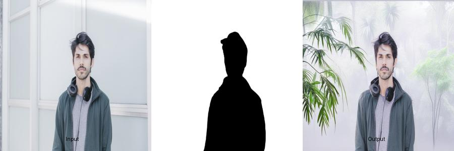

<p align="center">
  
</p>

---
# DRISHYAM : Image Background Replacement (FastAPI + BiRefNet + SDXL)

This project provides a **REST API for automatic background replacement** using BiRefNet for mask generation and Stable Diffusion XL for inpainting. Built with FastAPI, it supports custom prompts and high-quality results.

---

## 🔧 Technologies Used

- **FastAPI** – API framework
- **Torch** – Deep learning backend
- **BiRefNet** – Background mask generation
- **Stable Diffusion XL (SDXL)** – Inpainting pipeline
- **Diffusers, Transformers, Accelerate** – Hugging Face tools
- **OpenCV, Pillow, NumPy** – Image processing
- **Uvicorn** – ASGI server
- **dotenv** – Environment variable management

---
## 📦 Output Images :





---

## 📁 Project Structure

```
project/
│
├── main.py                 # FastAPI app
├── birefnet_model.py       # BiRefNet model & mask generation
├── inpaint.py              # SDXL inpainting pipeline
├── config.py               # Model configuration
├── model/                  # BiRefNet weights
├── static/results/         # Stores input, mask & output images
├── requirements.txt        # Python dependencies
├── .env                    # Environment variables
```

---

## ⚙️ Setup Instructions

### 1. Clone & Install Requirements

```bash
conda activate birefnet
```

```bash
git clone https://<Add-Access-Token-Here->@github.com/manishh-07/Drishyam_BGR.git
cd Drishyam_BGR
pip install -r requirements.txt
```

### 2. Add `.env` File

Create a `.env` file in the root with the following variables:

```env
RESULTS_DIR=static/results
BASE_SIGNED_URL=http://localhost:8003/static/results
AI_TOOL_ID=93ee5d74-b3c6-4cdf-96ab-e1decb7a39f7
```

### 3. Download BiRefNet Weights

Place the pretrained model file in `model/` directory:
```
cd Drishyam_BG/model
wget https://github.com/ZhengPeng7/BiRefNet/releases/download/v1/BiRefNet-DIS-epoch_590.pth
cd ..
```
```
model/BiRefNet-DIS-epoch_590.pth
```

### 4. Run the Server


```bash
python main.py
```

---

## ✅ Health Check

```http
GET /health
```

Response:
```json
{ "status": "healthy" }
```

---

## 📤 API: Background Change

### 1. POST `/background-change`

Change background using SDXL and BiRefNet.

#### Sample `curl`:

```bash
curl -X 'POST'   'http://127.0.0.1:8004/background-change'   -H 'accept: application/json'   -H 'Content-Type: multipart/form-data'   -F 'image=@121719602126-4-640x480.jpg;type=image/jpeg'   -F 'prompt=New York City'   -F 'user_id=2212'   -F 'template_id=string'
```

#### Sample Response:

```json
{
  "message": "Background change request accepted and is being processed",
  "generation_id": "869699b6-ac39-4064-b3a4-af2d314f23f8",
  "status": "processing",
  "status_url": "/backgroundchange/status/869699b6-ac39-4064-b3a4-af2d314f23f8",
  "width": 640,
  "height": 480
}
```

---

### 2. GET `/backgroundchange/status/{generation_id}`

Check the background change status and get the result.

#### Sample `curl`:

```bash
curl -X 'GET'   'http://127.0.0.1:8004/backgroundchange/status/869699b6-ac39-4064-b3a4-af2d314f23f8'   -H 'accept: application/json'
```

#### Sample Response:

```json
{
  "generation_id": "869699b6-ac39-4064-b3a4-af2d314f23f8",
  "progress": 100,
  "status": "completed",
  "message": "Background change completed successfully",
  "signed_result_url": "http://localhost:8003/static/results/result_869699b6-ac39-4064-b3a4-af2d314f23f8_0.png",
  "error": null,
  "result_image_dimensions": {
    "width": 640,
    "height": 480,
    "orientation": "landscape"
  },
  "content_id": "869699b6-ac39-4064-b3a4-af2d314f23f8",
  "credits_used": 10,
  "ai_tool_id": "93ee5d74-b3c6-4cdf-96ab-e1decb7a39f7"
}
```

## Cloud Setup Instructions 

```bash
bash environment/nvidia_drivers.sh

# Your system will reboot so wait for some time. then run following.

bash environment/nvidia_drivers2.sh

bash environment/anaconda_setup.sh

conda create -n drishyam python=3.10 -y

conda activate drishyam

conda install -c conda-forge cudatoolkit cudnn nccl

ln -sf $HOME/anaconda3/envs/drishyam/lib/python3.11/site-packages/nvidia/nvjitlink/lib/libnvJitLink.so.12 $HOME/anaconda3/envs/drishyam/lib/python3.11/site-packages/nvidia/cusparse/lib/libnvJitLink.so.12

bash environment/build_linux.sh

# Remember to upload .env file
```
---

